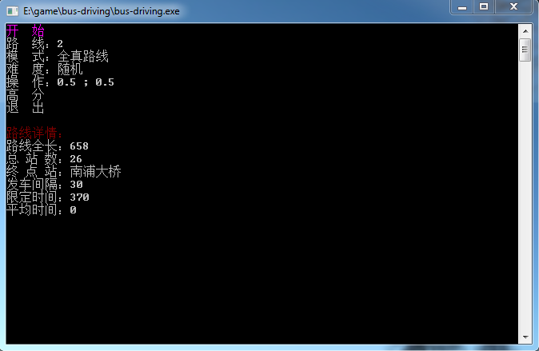
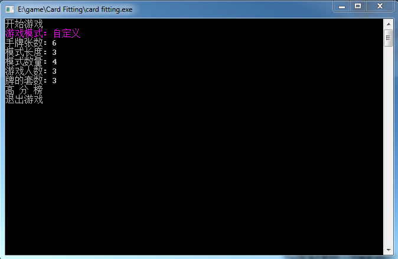
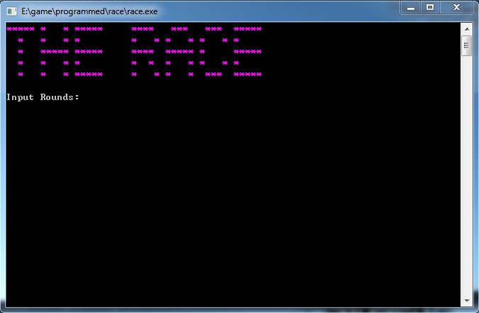

# Antique Games Written in PASCAL
## Introduction
I accidentally found those games in my computer. You can still run them and play!

Each directory contains a separate game: AmazingRace, BusDriving, CardArranging, CardFitting, MathGame, Monopoly, and Race

I wrote most of the games using the crt library, so there should be menus, and colors.

## How to run
You can build from source with a PASCAL compiler. 
I also find the compiled exe files (I believe those were compiled using FreePascal 2.0.4 IDE). However, since the file-paths were hard-coded, you have to respect my absolute paths...

Enjoy!

## Screenshots
- BusDriving:

- CardFitting:

- Race:
